[[English]](README_en.md)

# Adventure Time - Huy1902

# Lời đầu

+ Họ và tên: Nguyễn Quốc Huy - K68CB

+ Mã sinh viên: 23020082

+ Bài tập lớn: Adventure Time 

# Giới thiệu game

- Video giới thiệu game:

- Adventure Time là một game thuộc thể loại RPG. Game thủ được nhập vai vào một chiến binh vô danh đang trên con đường đánh bại các Lord of Space, những người nắm giữ quyền năng to lớn của The First Crystal. Liên tục đối đầu với những chiến binh thiện chiến, giành lấy sức mạnh to lớn và bước lên đỉnh vinh quang từ tro tàn. 

# 0. Cách tải game

## a. Cách 1: Không bao gồm code.

- Tải file AdventureTime!!!.rar tại link sau: [AdventureTime!!!v1.0.0](https://github.com/Huy1902/Adventure_Time/releases/tag/v1.0.0) hoặc bạn có thể click vào link này để tải ngay: https://github.com/Huy1902/Adventure_Time/releases/download/v1.0.0/AdventureTime.rar
- Giải nén game vào một thư mục bất kỳ và click vào file Adventure_Time.exe để khởi động game.

## b. Cách 2: Bao gồm code và có thể biên dịch.

**Bước 1:** Tải file source code trong phần release tại link sau: [AdventureTime!!!v1.0.0](https://github.com/Huy1902/Adventure_Time/releases/tag/v1.0.0) hoặc bạn có thể click vào link này để tải ngay: https://github.com/Huy1902/Adventure_Time/archive/refs/tags/v1.0.0.zip.

- Tất cả code đều nằm trong thư mục Adventure_Time.

**Bước 2:** Cài Visual Studio. Khi xây dựng chương trình, mình dùng Visual Studio 2022. Bạn có thể tham khảo hướng dẫn cài tại: https://learn.microsoft.com/en-us/visualstudio/install/install-visual-studio?view=vs-2022 hoặc trên Youtube: https://www.youtube.com/watch?v=HS4c3kBEWr4.

**Bước 3:** Mở file Adventure_Time.sln. 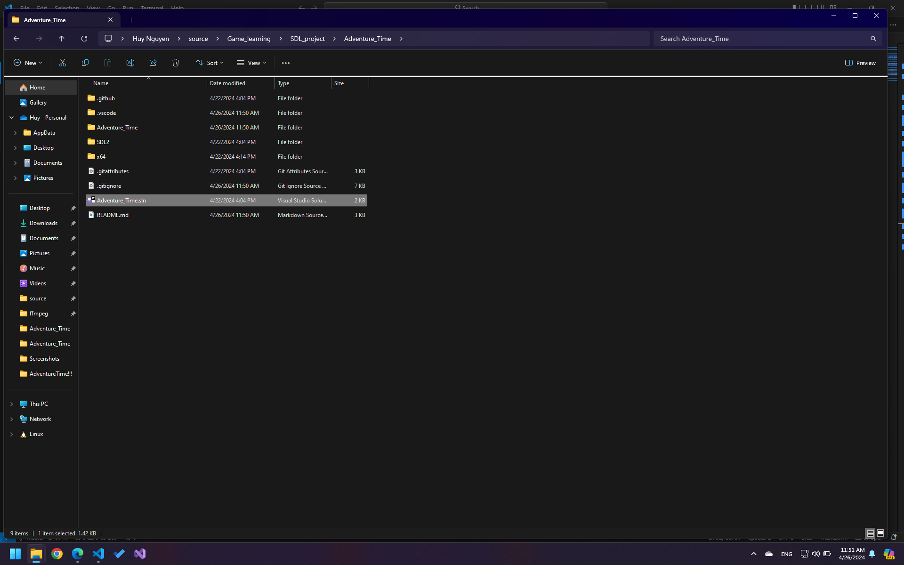
- Bạn có thể nhấn `Ctrl + F5` để chạy game trong Visual Studio.

# 1. Tính năng game
- Có intro sinh động khi vào game.
- Màn hình menu cùng các nút bật tắt âm thanh cho người chơi.
- Bảng xếp hạng điểm cập nhật sau mỗi lần chơi và lưu lại kết quả trên máy, có thể truy cập lại.
- Màn hình đợi cùng các Tip hữu ích khi chơi game.
- Background chuyển động vô hạn cùng âm nhạc nhẹ nhàng.
- SFX khi bạn click các nút bấm.
- Nhân vật chính có các hành động cùng âm thanh đi kèm sinh động.
- Hệ thống quái sở hữu hành động cùng các tính chất riêng.
- Boss mạnh mẽ và thử thách.
- Những sự kiện khác nhau cùng màn hình thành tựu: lưu save point, hạ boss, hồi sinh, bị hạ gục, đặt chân lên map khác.
- Hỗ trợ dừng game và xem trạng thái của nhân vật.
- Cơ chế level up và tăng sức mạnh nhân vật
- Hệ thống skill hỗ trợ người chơi tiêu diệt kẻ địch.
- Cơ chế đỡ và làm choáng kẻ địch.
- Cơ chế crit và miss các đòn đánh.

# 2. Bắt đầu game:
- Khi khởi động game, chương trình sẽ hiện màn hình Intro. Nhấn phím hoặc nhấn chuột trái để tiếp tục.
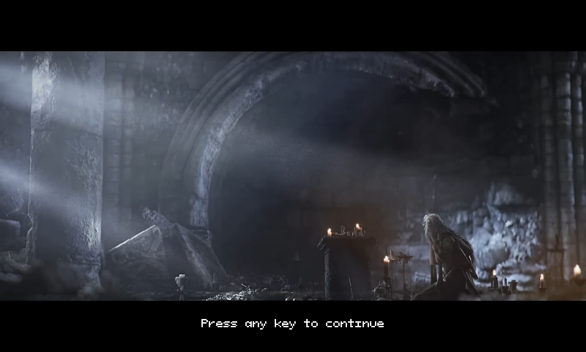

- Game sẽ vào thẳng màn hình chính.
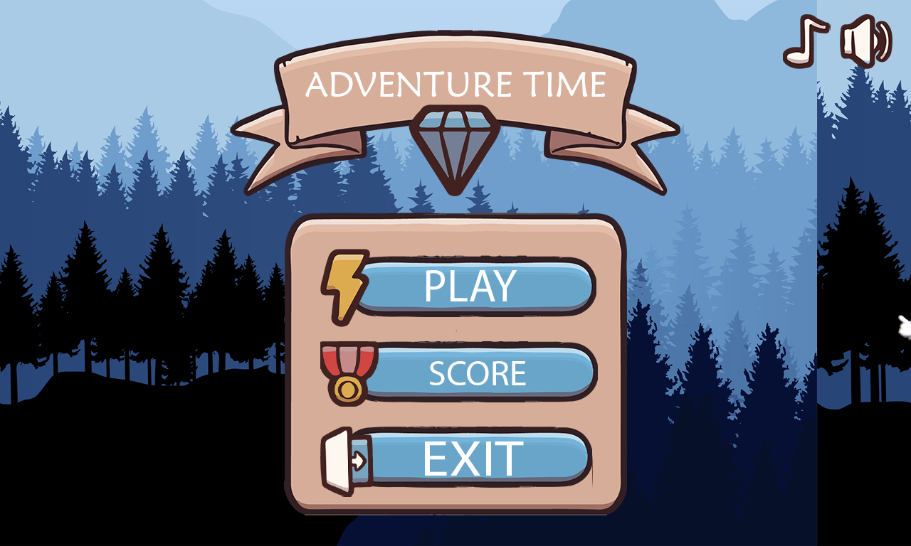

- Chọn `Play` để vào game hoặc chọn `Score` để xem bảng xếp hạng ba điểm cao nhất.
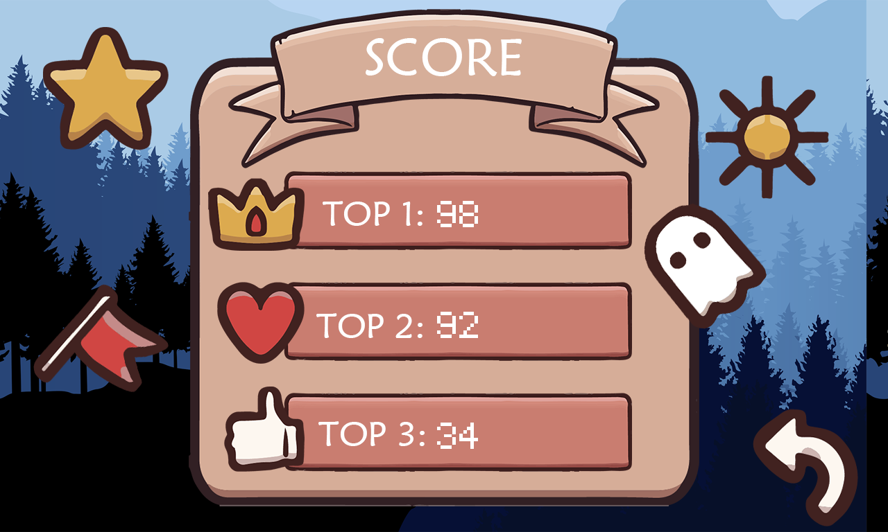

- Nhấn `Exit` để thoát game.

# 3. Hướng dẫn chơi game:
- Sau khi nhấn Play tại màn hình chính, người chơi sẽ thấy màn hình đợi. Đây cũng sẽ là màn hình hiện mỗi khi người chơi chuyển map. Có vài tip khá hữu dụng được hiện tại đây.
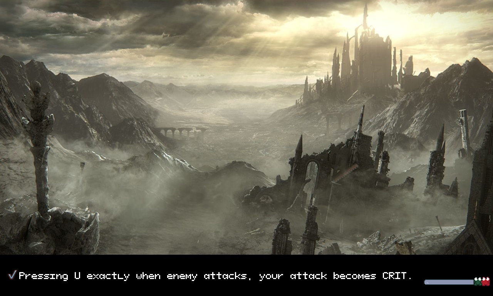

- Màn hình chơi game khá dễ làm quen. Điều bạn cần chú ý khi chơi là điểm số  và trạng thái máu và thể lực của nhân vật .
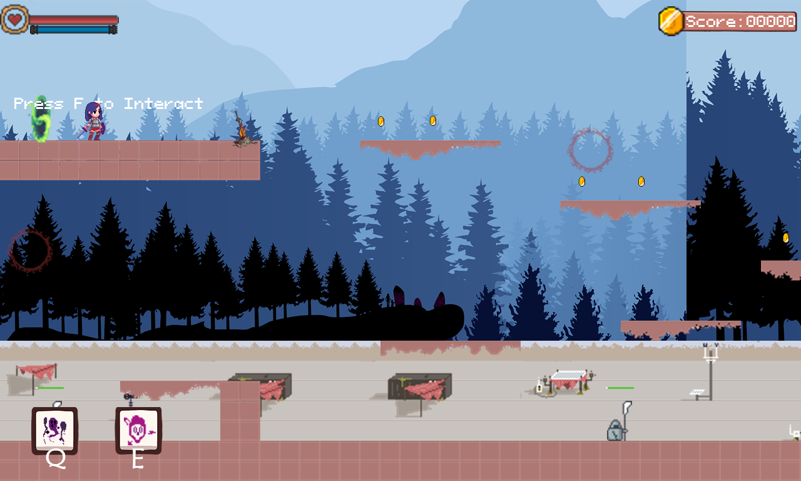

## a. Về nhân vật:

- Các phím điều khiển:

| Control |    Key   |
|---------|----------|
| LEFT    |     A    |
| RIGHT   |     D    |
| JUMP    |     K    |
| DASH    |     L    |
| ATTACK  |     J    |
| BASH    |     U    |
| SPELL 1 |     Q    |
| SPELL 2 |     E    |
| INTERACT|     F    |

- Lưu ý: Nếu nhân vật của bạn không di chuyển, hãy xem lại bạn có đang để ngôn ngữ khác ngoài tiếng Anh trên máy không. Với Window, chọn English tại Keyboard layout để nhân vật di chuyển mượt mà.

## b. Cơ chế chơi:
- Nhân vật gây sát thương lên kẻ địch bằng đòn tần công thường hoặc sử dụng các phép.
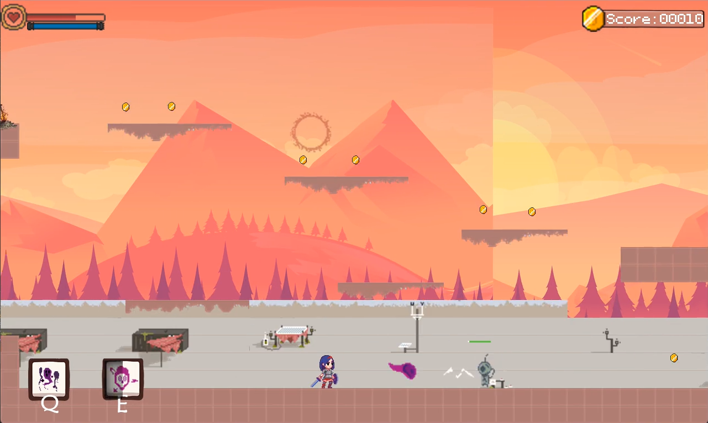

- Nhân vật có thể làm choáng kẻ địch bằng các đòn bash. Khi bash nhân vật sẽ không nhận sát thương, và nếu sử dụng đúng lúc kẻ địch tấn công, kẻ địch sẽ bị choáng.
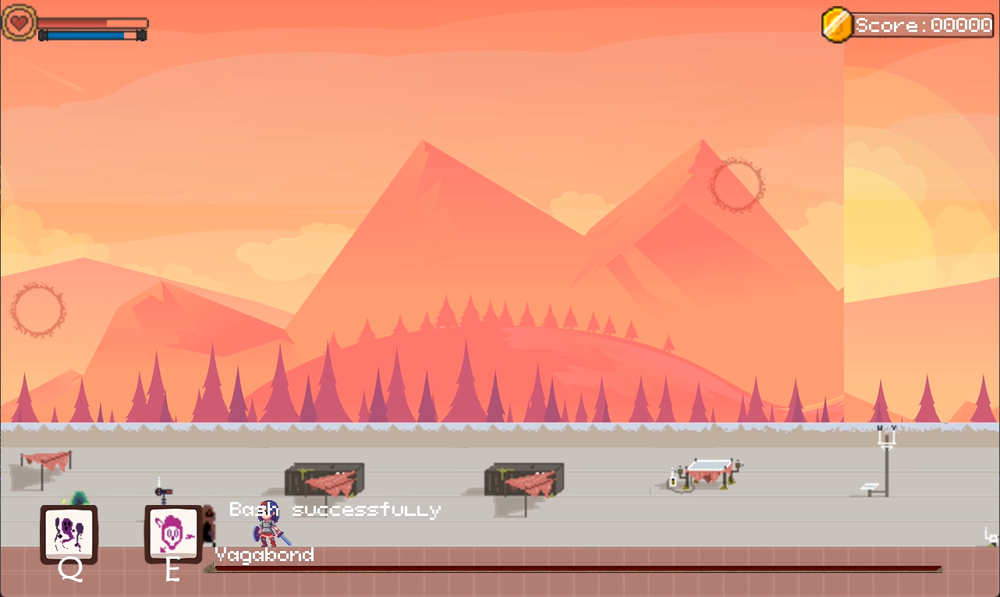

- Khi kẻ địch bị choáng, nhấn phím `J` nhân vật sẽ thực hiện đòn crit. Đây là đòn đánh gây cực kỳ nhiều sát thương. Hãy tận dụng cơ chế để hạ gục quái nhanh hơn.
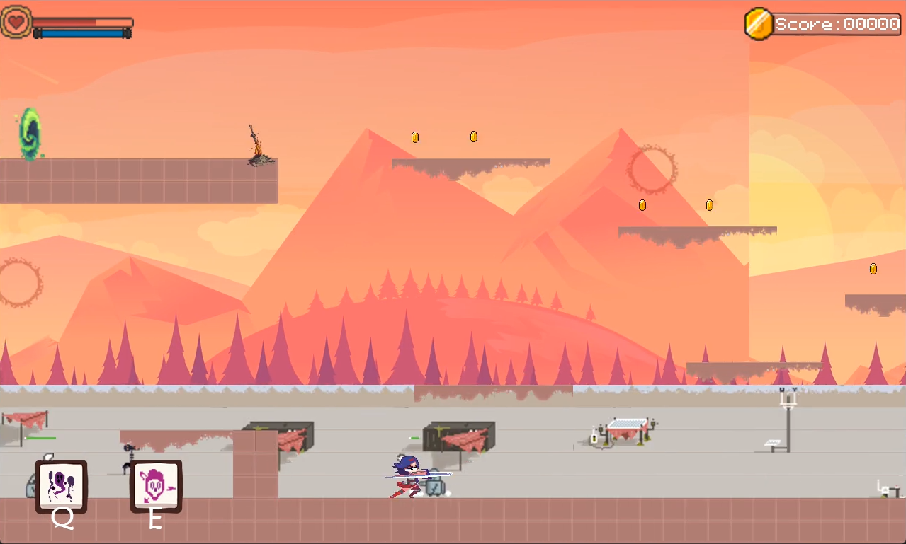
  + Lưu ý: Cơ chế này chỉ áp dụng với kẻ địch mang vũ khí tầm gần. Kẻ địch là cung thủ sẽ miễn khống chế.

- Nhân vât có thể lưu điểm hồi sinh tại các cổng dịch chuyển hoặc trại lửa.
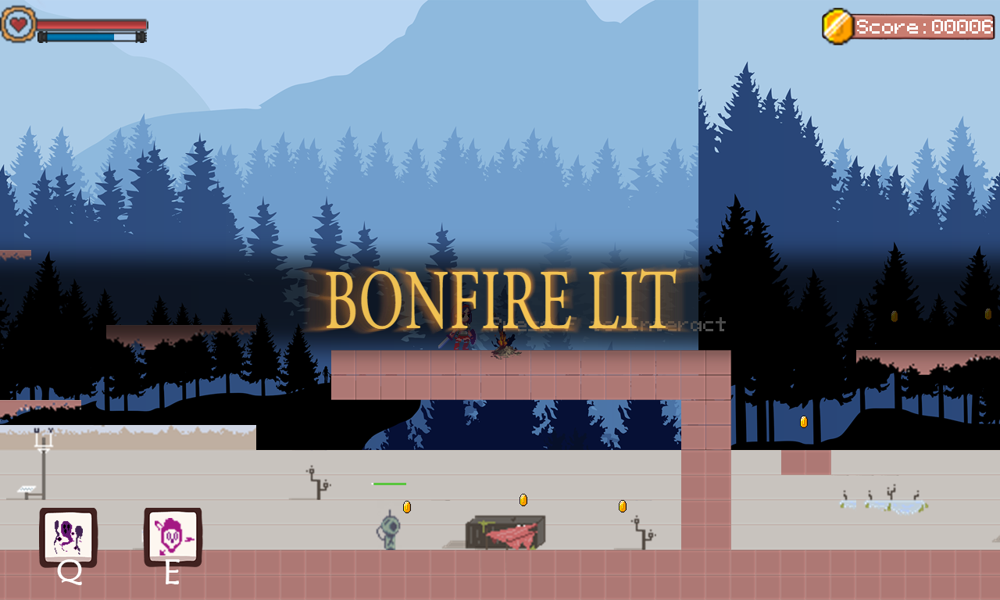

- Di chuyển của các map khác nhau bằng cổng dịch chuyển màu xanh lá cây, khi đặt chân tới một vùng đất tên của nó sẽ hiện lên màn hình.
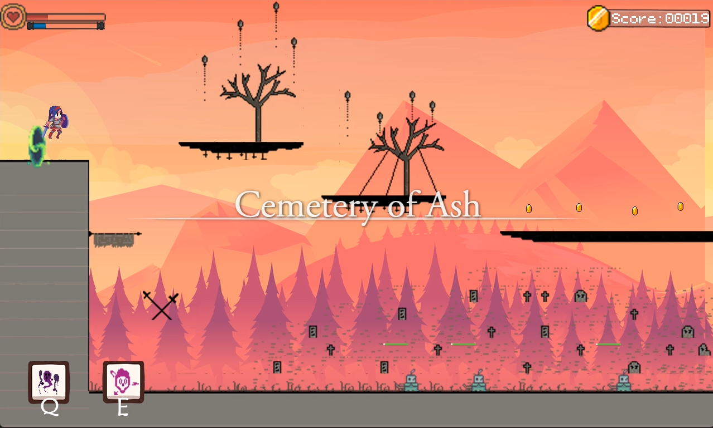

- Nếu kẻ địch hạ gục bạn, thông báo "You died" sẽ hiện ra.
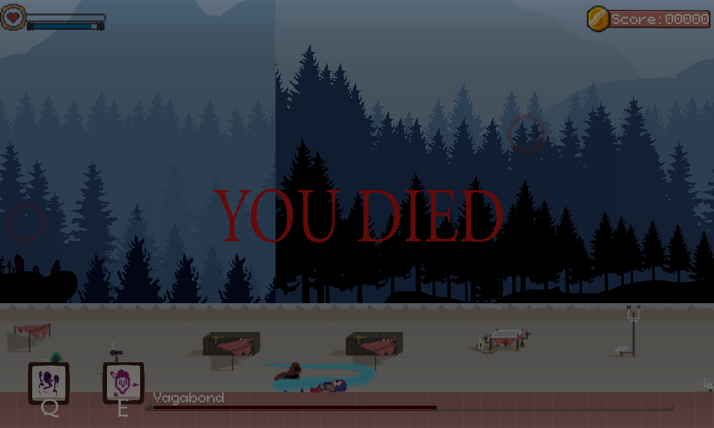

- Khi bị hạ gục, nhân vật sẽ hồi sinh tại điểm lưu gần nhất.
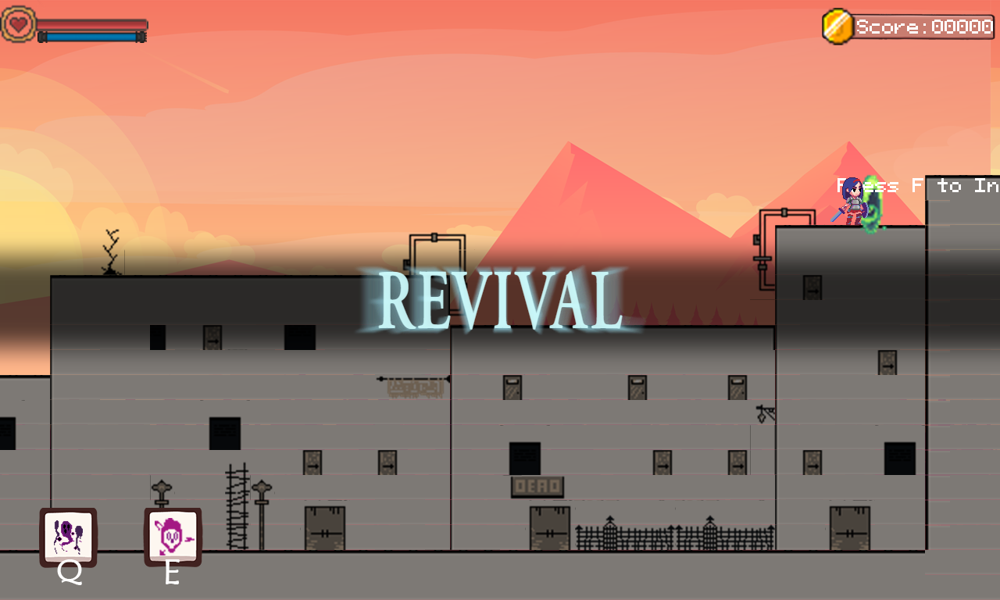

- Khi hạ gục boss, thành tựu sẽ hiện ra. Bạn đã trở nên mạnh mẽ hơn rồi.
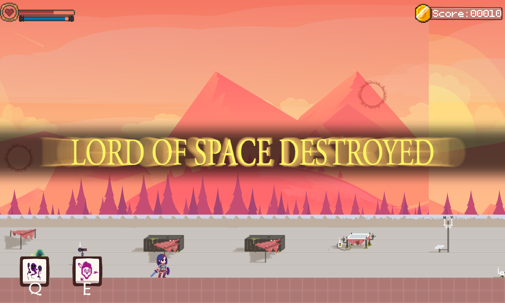

- Nhân vật và kẻ địch đều có chỉ số LUCK riêng, sẽ có khả năng né đón tấn công. 
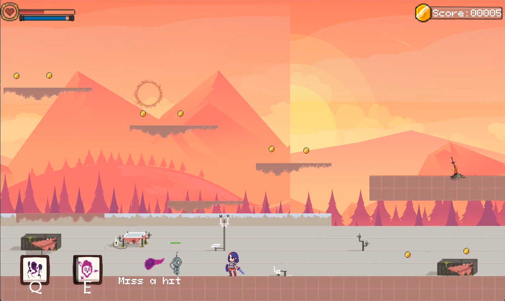

- Sử dụng các đòn tấn công thường hay lướt sẽ tiêu tốn thể lực. Ngược lại, khi dùng skill, bạn không tiêu tốn thể lực nhưng sẽ có thời gian hồi và gây ít sát thương hơn. Đòn crit không tiêu hao gì cả.

## c. Kẻ địch
- Có ba loại kẻ địch thường trong game:

|                                         | Tên kẻ địch	       | Khả năng và sức mạnh                                                                                       |
|-----------------------------------------|--------------------|--------------------------------------------------------------------------------------------------|
| 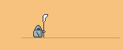 | Barrel Knight	  | Cận chiến, chiêu thức đa dạng, trâu bò khó giết bằng đòn đánh thường.                                                                       |
| 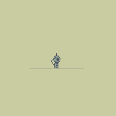  | Droid Zapper	       | Tầm đánh trung bình, sát thương cao                                               |
|   | Archer	   | Tầm đánh xa, Không thể bị làm choáng, sát thương những mũi tên lớn                                                                 |

- Khám phá cách đánh phù hợp nhất cho từng loại quái, và tùy trường hợp chạy là một phương án tốt.
## d. Boss
- Hiện chỉ có một Lord of Space là "Vagabond" trong trò chơi. Khi hạ gục nó, bạn đã phá đảo trò chơi rồi đó. Cố gắng đạt điểm tối đa cho các lần chơi nhé.
- Các chỉ số của Lord of Space đều cao. Hãy cẩn thận!
- Một vài hành động của Vagabond:

|  Hành động  |    Mô tả       |
|---------|------------------------------------------|
|     |     Chém ba đòn liên tiếp.      |
|     |     Tích sức mạnh, chém mạnh và dịch chuyển một đoạn    |
| 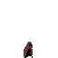     |     Bị hạ gục       |

## e. Cơ chế tính điểm
- Thu vàng hoặc hạ quái đều sẽ tăng điểm . 
- Riêng hạ Boss sẽ cho nhiều điểm hơn. Hạ quái đều sẽ tăng chỉ số cho người chơi.
- Điểm sẽ tự động được lưu khi bạn quay về màn hình chính. Bạn có thể xem nó trong Score.

## f. Cơ chế tăng cấp
- Hạ kẻ địch sẽ cho kinh nghiệm.
- Khi kinh nghiệm đạt ngưỡng, nhân vật sẽ lên level và tăng chỉ số.
- Cái chết sẽ lấy đi của bạn tất cả chỉ số đó.

## h. Tạm dừng và hồi sinh.
- Khi chơi game, bạn có thể nhấn `Esc` để tạm dừng game. Đồng thời tại đây, bạn có thể theo dõi các chỉ số của mình. Nhấn `Back home` sẽ đưa bạn về màn hình chính hoặc `Continue` để tiếp tục game.
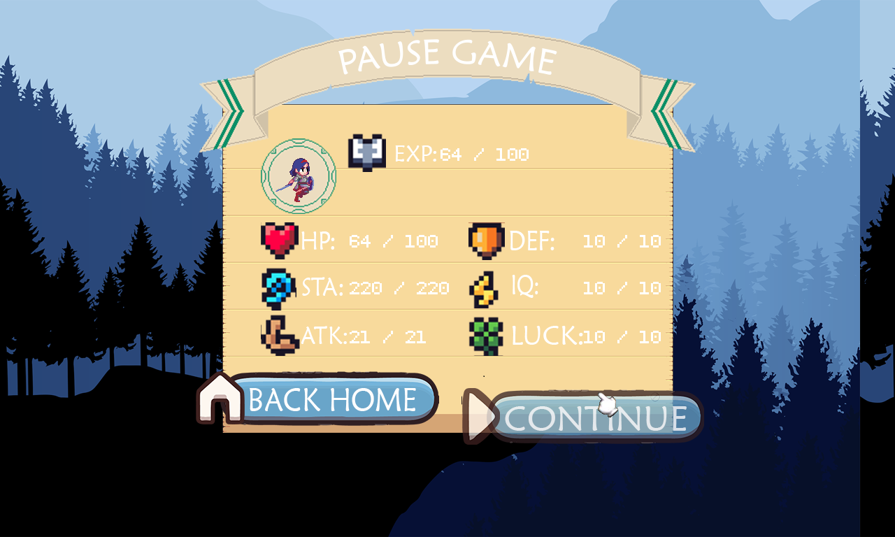

- Nếu bạn bị hạ gục, game sẽ hỏi bạn có muốn thử lại không. Nếu nhấn `Try again`, bạn sẽ được hồi sinh hoặc `Back home` để về màn hình chính.
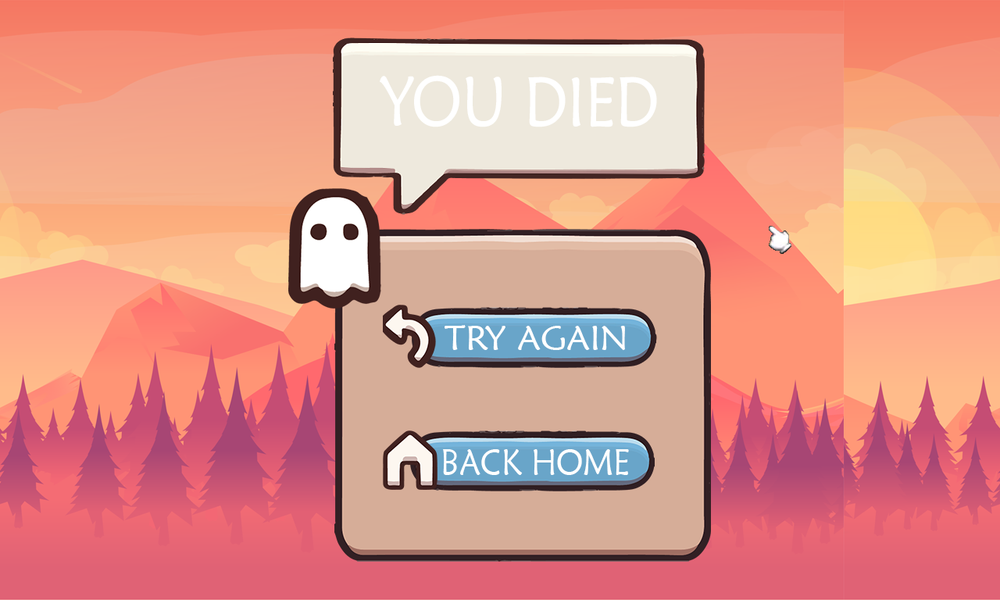

# 4. Về source code của game
## ***Lưu ý*** : Source code của game đã được sắp xếp và nằm trong folder [src](./src/) để mọi người tiện theo dõi.
## Tổng quát về các folder có trong folder [src](./src/) như sau:
- [Achievement](./src/Achievement/): quản lý thành tựu trong Game. Đọc thêm tại [đây](./src/Achievement/about_achieve_manager.md).
- [EnemyObject](./src/EnemyObject/): chứa các đối tượng enemy có trong chương trình.
- [Factory](./src/Factory/): áp dụng Factory Patter để viết các Generator, tự động hóa việc tạo các đối tượng được dịch từ file map(file .tmx). Đọc thêm tại [đây](./src/Factory/about_factory_method.md).
- [FiniteStateMachine](./src/FiniteStateMachine/): một máy trạng thái hữu hạn quản lý các state. Đọc thêm tại [đây](./src/FiniteStateMachine/about_finite_state_machine.md).
- [GameLoop](./src/GameLoop/): thực hiện nguyên tắc về game loop trong việc làm game. Đọc thêm tại [đây](./src/GameLoop/about_sequencing_patterns.md).
- [Graphic]: chứa các file xử lý đồ họa của game. Đọc thêm tại [đây](./src/Graphic/about_graphic.md).
- [InteractObject]: chứa các object tương tác được với người chơi.
- [Map]: chứa các file xử lý map và va chạm. Chi tiết tại [đây](./src/Map/about_map.md)
- [Misshit](./src/Misshit/): quản lý các đòn đánh và thông báo việc miss đòn đánh trong game.
- [Status](./src/Status/): quản lý và hiện thị trạng thái nhân vật và kẻ địch trong game.
- [Mode](./src/Model/): những model chính, các lớp cha của các object trong chương trình.
- [Observe](./src/Observe/): thực hiện Observe pattern và Command patter để bắt các sự kiện trong game. Chi tiết tại [đây](./src/Observe/about_observe_and_command.md)
- [Parser](./src/Parser/): trình dịch cho các file `.tmx` và `.xml`. Đây là cải tiến một project của mình từng viết trong quá khứ. Bạn có thể xem tại: https://github.com/Huy1902/XML
- [PlayerObject](./src/PlayerObject/): chứa lớp cho nhân vật chính của game mà người chơi điều khiển.
- [Sound](./src/Sound/): quản lý âm thanh trò chơi. Chi tiết tại [đây](./src/Sound/about_sound.md).
- [Spell](./src/Spell/): quản lý và chứa các object spell của nhân vật.
- [Standing](./src/Standing/): quản lý, lưu và hiển thị score của người chơi. Chi tiết ở [đây](./src/Standing/about_standing.md)
- [States](./src/States/): các state: menu, pause, game_over, score, play của trò chơi. Thực hiện theo State Patter, có FSM để quản lý. Chi tiết tại [đây](./src/States/about_state_pattern.md)
- [Utilities](./src/Utilities/): chứa các tiện ích cải thiện trải nghiệm người dùng. Chi tiết tại [đây](./src/Utilities/about_utilities.md).

# 5. Về tài nguyên trong game
- Folder chứa tài nguyên game: [assets](./Adventure_Time/assets/).
- Chi tiết về hình ảnh(nguồn, cách xử lý và phương thức sử dụng): [graphic](./src/Graphic/about_graphic.md)
- Chi tiết về âm thanh(nguồn, cách xử lý và phương thức sử dụng):
[sound](./src/Sound/about_sound.md)
- Chi tiết về font chứ: [font](./src/Utilities/Font/about_font.md).
- Chi tiết về các loại file: [file](./src/about_file_type.md).

- Tất cả các tài nguyên trong game đều được mình tự tìm kiếm, nhiều phần trong số đó là dạng thô, cần phải xử lý qua các phần mềm edit như Adobe Photoshop, Aseprite, Tiled, Adobe Premiere, Adobe Audition. Điều này khá mất thời gian và công sức.

# 6. Tổng kết 

## ***Điểm tốt***
- Dự án này hoàn toàn là do em tự làm, tự học hỏi và tìm tòi không đi sao chép ở bất kì đâu. Code hoàn toàn do chính tay em viết ra 100%.

- Cải thiện trau dồi tư duy lập trình theo hướng đối tượng, tư duy lên kế hoạch và phát triển sản phẩm.

- Học thêm về design pattern, edit cùng nhiều phần mềm khác nhau.
Đa số hình ảnh, âm thanh đều do em edit.

- Học được cách setup môi trường, sử dụng thư viện ngoài. 

### ***Điểm hạn chế*** 
- Code còn chưa thực sự rõ ràng như em mong muốn. Nhiều phần còn chưa tách hẳn nhau. Điều này sẽ gây khó khăn khi muốn phát triển sản phẩm lớn hơn

### ***Hướng phát triển*** 
- Sử dụng các Pattern để tối ưu hóa chương trình. Model lại chương trình để dễ dàng update hơn.

- Hoàn thiện cốt truyện của nhân vật

- Thêm các NPC vào chương trình để nhân vật giao tiếp, mua bán.

- Mục tiêu của em khi xây dựng game là: xây dựng lối đánh tương tự Dark Soul 3 và hệ thống kỹ năng, lên cấp như Final Fantasy 9. Hiện game của em chỉ mới thể hiện được một phần, tương lai cần hoàn thiện thêm.

- Thêm các item vào để nhân vật tương tác như: bình máu. sách phép, ...

- Thêm rương báu và hệ thống nhặt đồ, túi đồ.

### *Mức điểm tự đánh giá: 9.5++ / 10* 