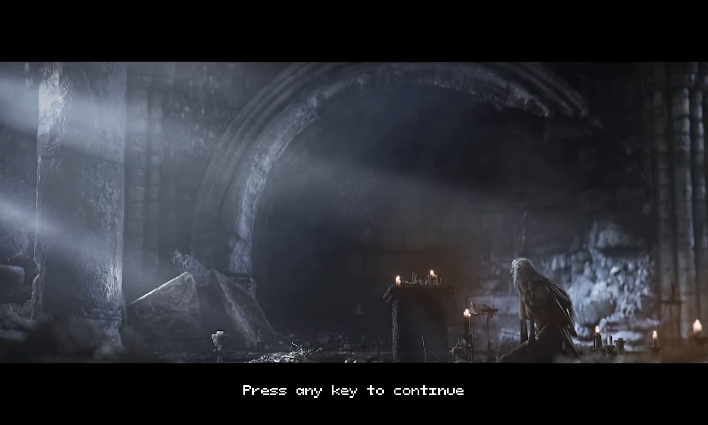
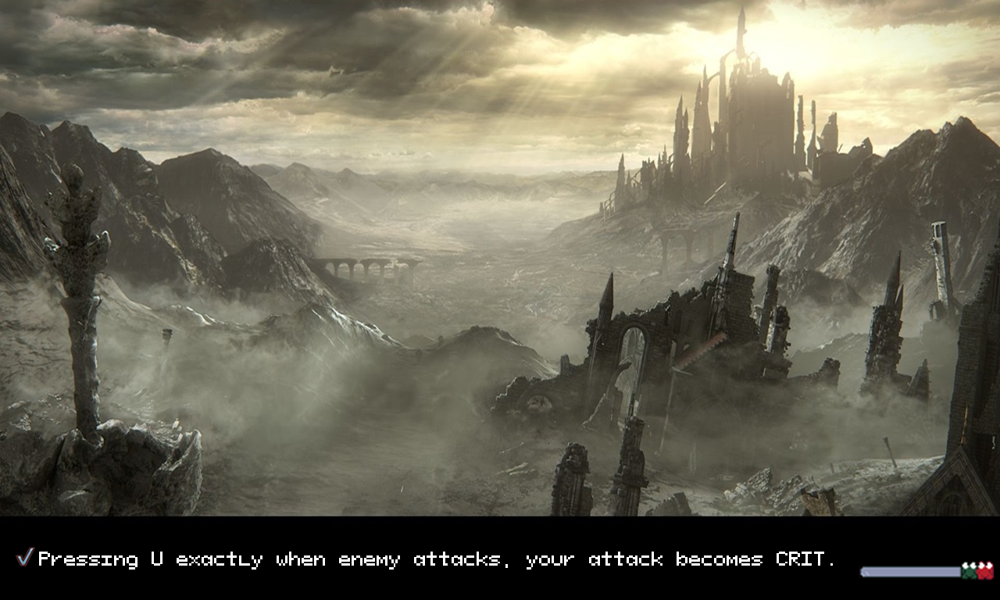
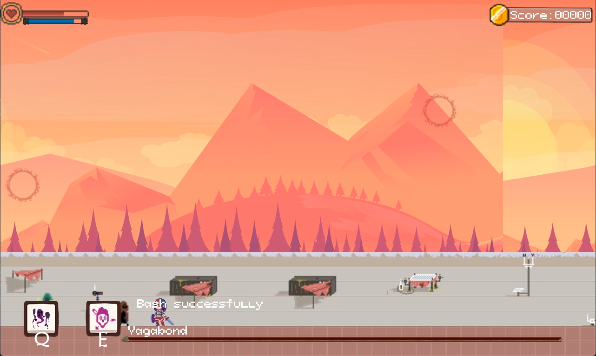
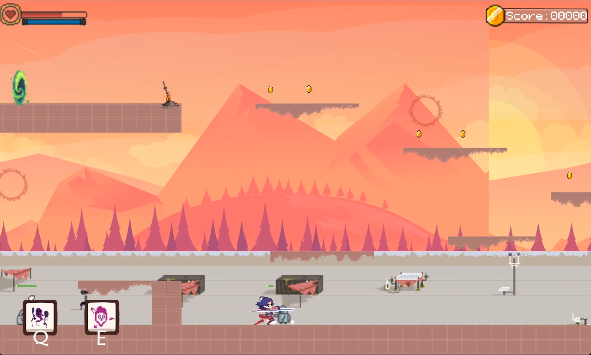
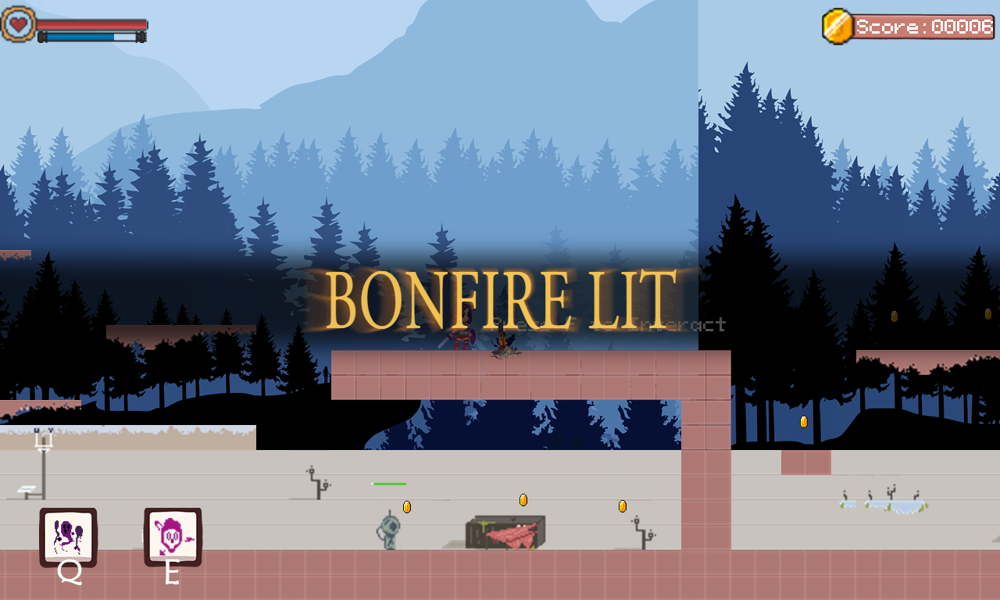
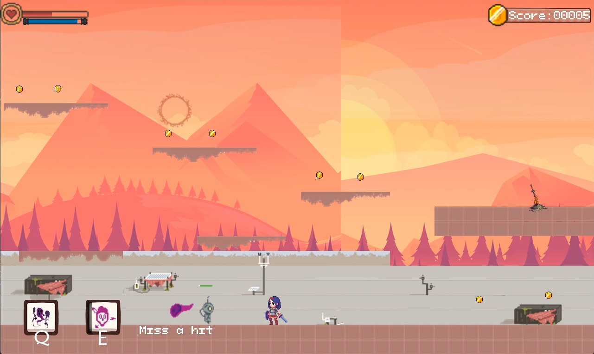
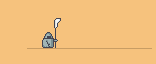
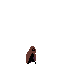
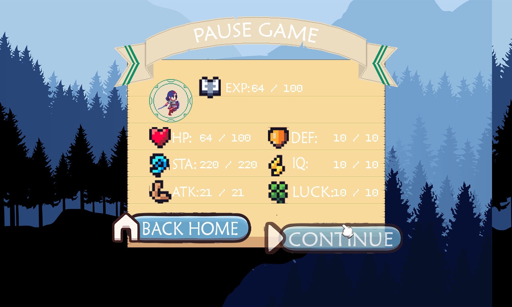
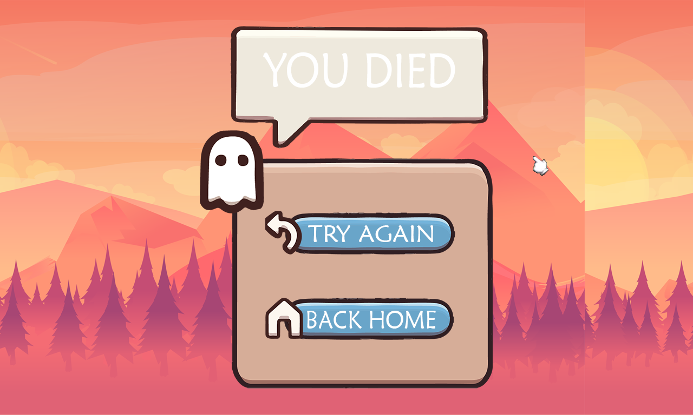

[[Tiếng Việt]](README.md)

# AdventureTime - Huy1902

# Preface

+ Full name: Nguyen Quoc Huy - K68CB

+ Student code: 23020082

+ Project: Adventure Time

# Introducing the game

- Game introduction video: https://drive.google.com/file/d/1rFcbf3gFON2YECewMfVyV4nu8jZ-IW9Y/view?usp=sharing

- Adventure Time is a game in the RPG genre. Gamers take on the role of an NoName warrior on the path to defeat the Lords of Space, who hold the great power of The First Crystal. Continuously confront skilled warriors, gain great power and rise to glory from the ashes.

- [0. How to download game](#0-how-to-download-the-game)
   + [a. Method 1: Does not include code.](#a-method-1-do-not-include-code)
   + [b. Method 2: Includes code and can compile.](#b-method-2-include-code-and-compile)
- [first. Game features](#1-game-features)
- [2. Start the game:](#2-start-the-game)
- [3. Instructions for playing the game](#3-instructions-for-playing-the-game)
   +[a. About the character:](#a-about-the-character)
   +[b. About the playing mechanism](#b-about-the-playing-mechanism)
   +[c. Enemy](#c-enemy)
   +[d. Boss](#d-boss)
   +[e. Scoring mechanism](#e-scoring-mechanism)
   +[f. Level-up mechanism](#f-level-up-mechanism)
   +[g. Pause and revive.](#g-pause-and-revive)
- [4. About the game's source code](#4-about-the-game's-source-code)
- [5. About in-game resources](#5-about-in-game-resources)
- [6. Summary ](#6-summary)

# 0. How to download the game

## a. Method 1: Do not include code.

- Download the AdventureTime!!!.rar file at the following link: [AdventureTime!!!v1.0.0](https://github.com/Huy1902/Adventure_Time/releases/tag/v1.0.0) or you can click on the link to download now: https://github.com/Huy1902/Adventure_Time/releases/download/v1.0.0/AdventureTime.rar
- Extract the game into any folder and click on the Adventure_Time.exe file to start the game.

## b. Method 2: Include code and compile.

**Step 1:** Download the source code file in the release section at the following link: [AdventureTime!!!v1.0.0](https://github.com/Huy1902/Adventure_Time/releases/tag/v1.0.0) or you You can click on this link to download immediately: https://github.com/Huy1902/Adventure_Time/archive/refs/tags/v1.0.0.zip.

- All code is in the Adventure_Time folder.

**Step 2:** Install Visual Studio. When building the program, I use Visual Studio 2022. You can refer to the installation instructions at: https://learn.microsoft.com/en-us/visualstudio/install/install-visual-studio?view=vs-2022 or on Youtube: https://www.youtube.com/watch?v=HS4c3kBEWr4.

**Step 3:** Open the file Adventure_Time.sln. 
- You can press `Ctrl + F5` to run the game in Visual Studio.

# 1. Game features
- There is a lively intro when entering the game.
- Menu screen with sound toggle buttons for players.
- The score rankings are updated after each play and the results are saved on the device for re-access.
- Waiting screen with useful tips when playing games.
- Infinite moving background with gentle music.
- SFX when you click buttons.
- The main character has lively actions and accompanying sounds.
- The monster system has its own actions and characteristics.
- Powerful and challenging Boss.
- Different events with achievement screen: saving save point, defeating boss, respawn, being defeated, setting foot on another map.
- Support stopping the game and viewing the character's status.
- Level up mechanism and increase character strength
- Skill system helps players destroy enemies.
- Mechanism to block and stun enemies.
- Crit and miss mechanism for attacks.

# 2. Start the game:
- When starting the game, the program will display the Intro screen. Press the key or left click to continue.

- The game will go straight to the main screen.

- Select `Play` to enter the game or select `Score` to see the ranking of the three highest scores.

- Press `Exit` to exit the game.

# 3. Instructions for playing the game:
- After pressing Play on the main screen, the player will see the waiting screen. This will also be the screen that appears every time the player switches maps. There are some pretty useful tips out there right now.

- The gaming screen is quite easy to get used to. What you need to pay attention to when playing is the score  and the character's health and stamina status .

## a. About the character:

- Control keys:

| Control | Key |
|--------|----------|
| LEFT | A |
| RIGHT | D |
| JUMP | K |
| DASH | L |
| ATTACK | J |
| BASH | U |
| SPELL 1 | Q |
| SPELL 2 | E |
| INTERACT|     F    |

- Note: If your character does not move, check to see if you have a language other than English on the device. With Window, select English at Keyboard layout so the character moves smoothly.

## b. About the playing mechanism:
- The character deals damage to enemies with regular attacks or using spells.

- Characters can stun enemies with bash attacks. When bash the character will not receive damage, and if used at the right time when the enemy attacks, the enemy will be stunned.

- When the enemy is stunned, pressing the `J` key will cause the character to perform a critical attack. This is an attack that deals a lot of damage. Take advantage of the mechanism to defeat monsters faster.

   + Note: This mechanism only applies to enemies carrying close-range weapons. Enemies that are archers will be immune to control.

- Characters can save respawn points at portals or bonfires.

- Travel to different maps using the green teleportation gate. When you arrive at a land, its name will appear on the screen.

- If an enemy defeats you, the message "You died" will appear.

- When defeated, the character will respawn at the nearest save point.

- When defeating the boss, achievements will appear. You have become stronger already.

- Characters and enemies both have their own LUCK index, and will be able to dodge attacks.

- Using normal or gliding attacks will consume stamina. On the contrary, when using skills, you do not consume stamina but will have cooldown time and deal less damage. Crit attacks do not consume anything.

## c. Enemy
- There are three types of common enemies in the game:

|                                         | Enemy name	       |                                 Abilities and Powers                                            |
|-----------------------------------------|--------------------|--------------------------------------------------------------------------------------------------|
|  | Barrel Knight	  | Close combat, diverse moves, difficult to kill with normal attacks.thường.                                                                       |
|   | Droid Zapper	       | Medium attack range, high damage                                              |
|   | Archer	   | Long range, Cannot be stunned, damage arrows                                                                 |

- Discover the most suitable fighting style for each type of monster, and depending on the situation, running is a good option.
## d. Boss
- There is currently only one Lord of Space, "Vagabond", in the game. When you defeat it, you've ruined my game. Try to get maximum points for each game.
- Lord of Space's stats are all high. Be careful!
- Some actions of Vagabond:

|  Action  |   Description      |
|---------|------------------------------------------|
|     |     Slash three consecutive attacks.     |
|     |     Accumulate power, slash hard and teleport a distance   |
|      |    Knocked out     |

## e. Scoring mechanism
- Collecting gold or defeating monsters will increase your score.
- Defeating the Boss will give you more points. Defeating monsters will increase the player's stats.
- Scores will automatically be saved when you return to the main screen. You can see it in Score.

## f. Level up mechanism
- Defeating enemies will give experience.
- When experience reaches the threshold, the character will level up and increase his stats.
- Death will take away all of your stats.

## g. Pause and revive.
- When playing a game, you can press `Esc` to pause the game. At the same time here, you can track your metrics. Pressing `Back home` will take you to the main screen or `Continue` to continue the game.

- If you are defeated, the game will ask if you want to try again. If you press `Try again`, you will be revived or `Back home` will return to the main screen.

# 4. About the game's source code
## ***Note***: The game's source code has been arranged and is located in the [src](./src/) folder for everyone's convenience.
## Overview of folders in folder [src](./src/) is as follows:
- [Achievement](./src/Achievement/): manages achievements in the Game. Read more at [here](./src/Achievement/about_achieve_manager.md).
- [EnemyObject](./src/EnemyObject/): contains enemy objects in the program.
- [Factory](./src/Factory/): applies Factory Pattern to write Generators, automating the creation of objects translated from map file(.tmx file). Read more at [here](./src/Factory/about_factory_method.md).
- [FiniteStateMachine](./src/FiniteStateMachine/): a finite state machine that manages states. Read more at [here](./src/FiniteStateMachine/about_finite_state_machine.md).
- [GameLoop](./src/GameLoop/): implements the principle of game loop in game making. Read more at [here](./src/GameLoop/about_sequencing_patterns.md).
- [Graphic]: contains the game's graphic processing files. Read more at [here](./src/Graphic/about_graphic.md).
- [InteractObject]: contains objects that can interact with the player.
- [Map]: contains map and collision processing files. Details at [here](./src/Map/about_map.md)
- [Misshit](./src/Misshit/): manages attacks and reports missed attacks in the game.
- [Status](./src/Status/): manages and displays the status of characters and enemies in the game.
- [Mode](./src/Model/): main models, parent classes of objects in the program.
- [Observe](./src/Observe/): implement Observe pattern and Command pattern to capture events in the game. Details at [here](./src/Observe/about_observe_and_command.md)
- [Parser](./src/Parser/): compiler for `.tmx` and `.xml` files. This is an improvement on a project I wrote in the past. You can view it at: https://github.com/Huy1902/XML
- [PlayerObject](./src/PlayerObject/): contains the class for the main character of the game that the player controls.
- [Sound](./src/Sound/): manages game sound. Details at [here](./src/Sound/about_sound.md).
- [Spell](./src/Spell/): manages and stores the character's spell objects.
- [Standing](./src/Standing/): manages, saves and displays player scores. Details are [here](./src/Standing/about_standing.md)
- [States](./src/States/): states: menu, pause, game_over, score, play of the game. Follow the State Pattern, have FSM for management. Details at [here](./src/States/about_state_pattern.md)
- [Utilities](./src/Utilities/): contains utilities to improve user experience. Details at [here](./src/Utilities/about_utilities.md).

# 5. About in-game resources
- Folder containing game resources: [assets](./Adventure_Time/assets/).
- Details about the image (source, processing and method of use): [graphic](./src/Graphic/about_graphic.md)
- Details about sound (source, processing and method of use):
[sound](./src/Sound/about_sound.md)
- Details about the font: [font](./src/Utilities/Font/about_font.md).
- Details about file types: [file](./src/about_file_type.md).

- All resources in the game are searched by myself, many of them are in raw form, needing to be processed through editing software such as Adobe Photoshop, Aseprite, Tiled, Adobe Premiere, Adobe Audition. This takes quite a bit of time and effort.

# 6. Summary

## ***Good mark***
- This project was completely done by me, I learned and researched it myself and did not copy it anywhere. The code is 100% written by myself.

- Improve and cultivate object-oriented programming thinking, planning and product development thinking.

- Learn more about design patterns, editing and many different software.
Most of the images and sounds are edited by me.

- Learn how to set up the environment and use external libraries.

### ***Limitations***
- The code is not really as clear as I would like. Many parts have not yet been completely separated from each other. This will make it difficult to develop larger products

### ***Development***
- Use Patterns to optimize the program. Remodel the program to make it easier to update.

- Complete the character's backstory

- Add NPCs to the program for characters to communicate and buy and sell.

- My goal when building the game is: to build a fighting style similar to Dark Soul 3 and a skill system, leveling up like Final Fantasy 9. Currently my game is only partially demonstrated, it needs to be improved in the future. more.

- Add items for characters to interact with such as: health potions. spell books,...

- Added treasure chests and loot and inventory system.

### *Self-assessment score: 9.5++ / 10*

### Reference source:
- Design patterns at: https://gameprogrammingpatterns.com/contents.html and https://www.geeksforgeeks.org/software-design-patterns/
- How to use libraries and functions at: https://lazyfoo.net/tutorials/SDL/index.php
- Learning source on Youtube: https://www.youtube.com/watch?v=1KD4Ae0tX0g&list=PL-K0viiuJ2RctP5nlJlqmHGeh66-GOZR_